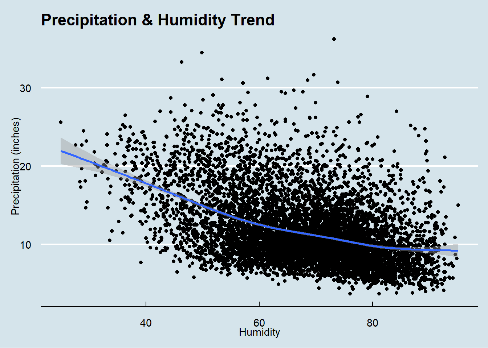
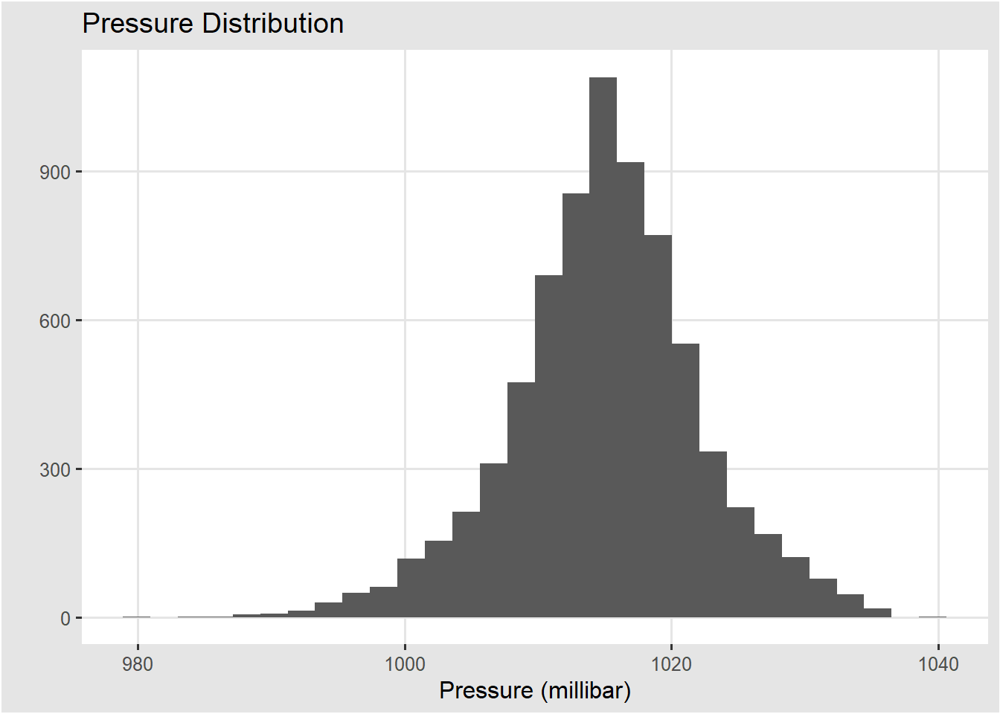
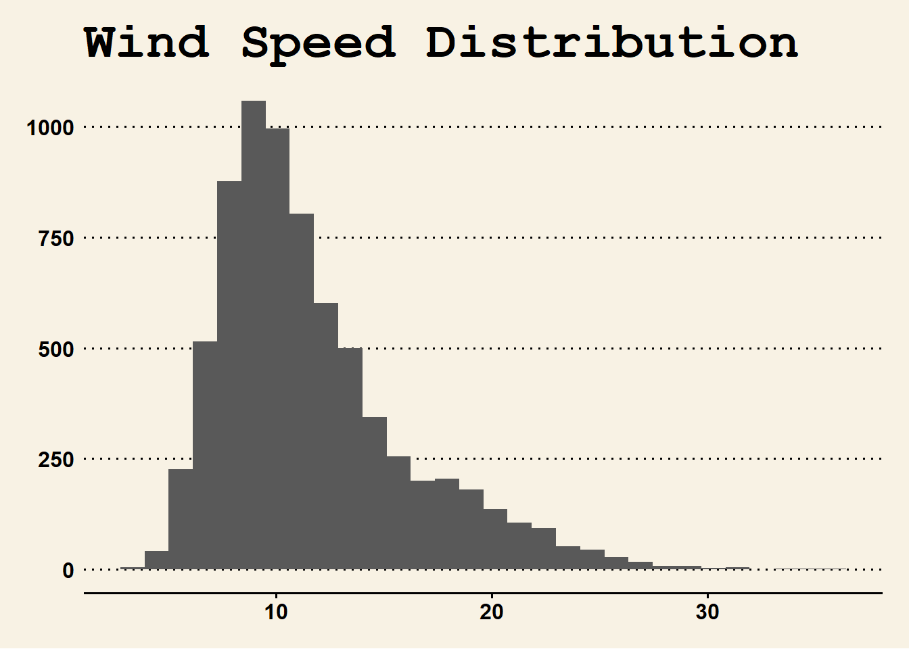
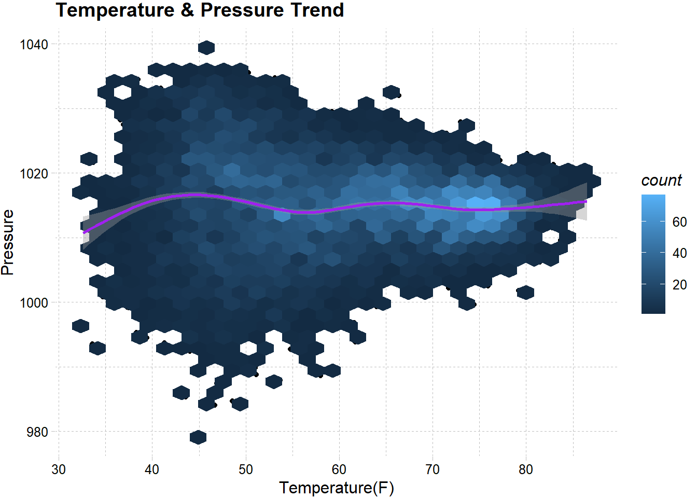
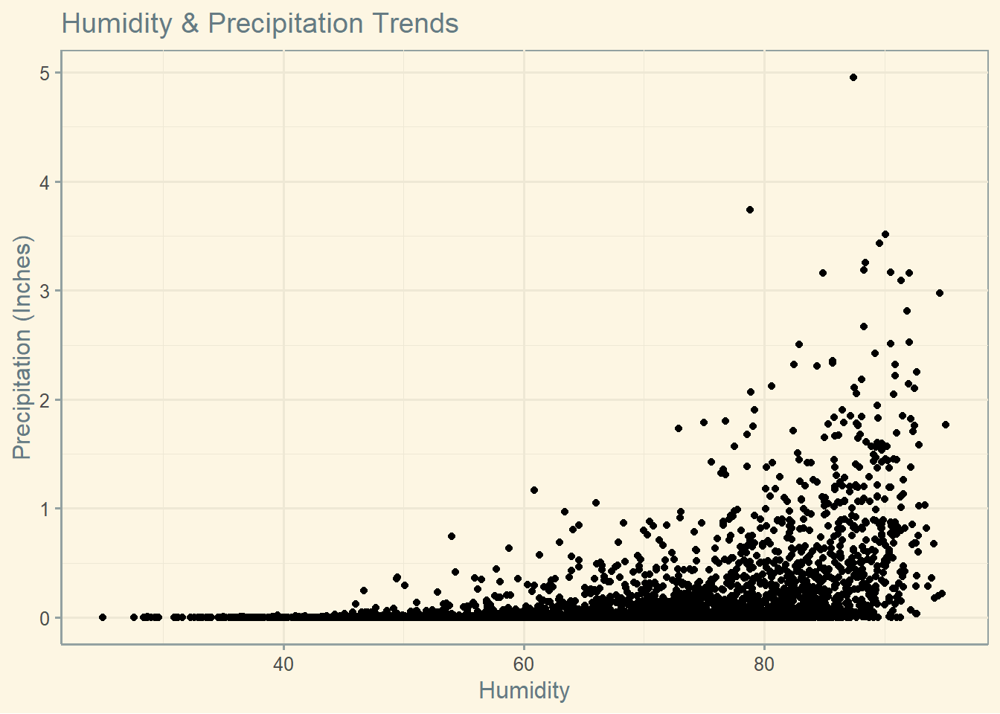

::: {.cell}

```{.r .cell-code}
library(tidyverse)
```

::: {.cell-output .cell-output-stderr}

```
── Attaching core tidyverse packages ──────────────────────── tidyverse 2.0.0 ──
✔ dplyr     1.1.4     ✔ readr     2.1.5
✔ forcats   1.0.0     ✔ stringr   1.5.1
✔ ggplot2   3.5.1     ✔ tibble    3.2.1
✔ lubridate 1.9.4     ✔ tidyr     1.3.1
✔ purrr     1.0.2     
── Conflicts ────────────────────────────────────────── tidyverse_conflicts() ──
✖ dplyr::filter() masks stats::filter()
✖ dplyr::lag()    masks stats::lag()
ℹ Use the conflicted package (<http://conflicted.r-lib.org/>) to force all conflicts to become errors
```


:::

```{.r .cell-code}
library(mosaic)
```

::: {.cell-output .cell-output-stderr}

```
Registered S3 method overwritten by 'mosaic':
  method                           from   
  fortify.SpatialPolygonsDataFrame ggplot2

The 'mosaic' package masks several functions from core packages in order to add 
additional features.  The original behavior of these functions should not be affected by this.

Attaching package: 'mosaic'

The following object is masked from 'package:Matrix':

    mean

The following objects are masked from 'package:dplyr':

    count, do, tally

The following object is masked from 'package:purrr':

    cross

The following object is masked from 'package:ggplot2':

    stat

The following objects are masked from 'package:stats':

    binom.test, cor, cor.test, cov, fivenum, IQR, median, prop.test,
    quantile, sd, t.test, var

The following objects are masked from 'package:base':

    max, mean, min, prod, range, sample, sum
```


:::

```{.r .cell-code}
library(rio)
```

::: {.cell-output .cell-output-stderr}

```

Attaching package: 'rio'

The following object is masked from 'package:mosaic':

    factorize
```


:::

```{.r .cell-code}
library(downloader)
library(ggthemes)
```

::: {.cell-output .cell-output-stderr}

```

Attaching package: 'ggthemes'

The following object is masked from 'package:mosaic':

    theme_map
```


:::
:::

::: {.cell}

```{.r .cell-code}
data <- read.csv("C:\\Users\\Alex\\Documents\\GitHub\\WECC\\2000-2020-rexburg.csv")

data <- data %>%
  rename(Temperature_f = Temperature..F.,
         Precipitation_in = Precipitation..inches.,
         Pressure_mb = Pressure..mb.,
         Wind_Speed = Wind.Speed..mph.)
```
:::

::: {.cell}

```{.r .cell-code}
ggplot(data, mapping = aes(x= Humidity, y = Wind_Speed, col)) + 
geom_point() +
geom_smooth() +
labs(title = "Precipitation & Humidity Trend",
        y = "Precipitation (inches)") +
  theme_economist()
```

::: {.cell-output .cell-output-stderr}

```
`geom_smooth()` using method = 'gam' and formula = 'y ~ s(x, bs = "cs")'
```


:::

::: {.cell-output-display}
{width=672}
:::
:::

::: {.cell}

```{.r .cell-code}
ggplot(data, mapping = aes(x = Pressure_mb)) + 
  geom_histogram() + 
  labs(title = "Pressure Distribution",
       x = "Pressure (millibar)",
       y = "") + 
  theme_igray()
```

::: {.cell-output .cell-output-stderr}

```
`stat_bin()` using `bins = 30`. Pick better value with `binwidth`.
```


:::

::: {.cell-output-display}
{width=672}
:::
:::

::: {.cell}

```{.r .cell-code}
ggplot(data, mapping = aes(x = Wind_Speed)) + 
geom_histogram() + 
labs(title = "Wind Speed Distribution",
     x = "Wind Speed (Miles per Hour)",
     y = "") +
  theme_wsj()
```

::: {.cell-output .cell-output-stderr}

```
`stat_bin()` using `bins = 30`. Pick better value with `binwidth`.
```


:::

::: {.cell-output-display}
{width=672}
:::
:::

::: {.cell}

```{.r .cell-code}
ggplot(data, mapping = aes(x = Temperature_f, y = Pressure_mb)) + geom_point() +
geom_hex()+
geom_smooth(color = "purple") +
theme_gray()+
labs(title = "Temperature & Pressure Trend",
     x = "Temperature(F)",
     y = "Pressure") +
  theme_pander()
```

::: {.cell-output .cell-output-stderr}

```
`geom_smooth()` using method = 'gam' and formula = 'y ~ s(x, bs = "cs")'
```


:::

::: {.cell-output-display}
{width=672}
:::
:::


The temperature and pressure features of the data show


::: {.cell}

```{.r .cell-code}
ggplot(data, mapping = aes(x = Humidity, y = Precipitation_in)) + 
geom_point() +
  labs(title = "Humidity & Precipitation Trends",
       y = "Precipitation (Inches)") +
  theme_solarized()
```

::: {.cell-output-display}
{width=672}
:::
:::
